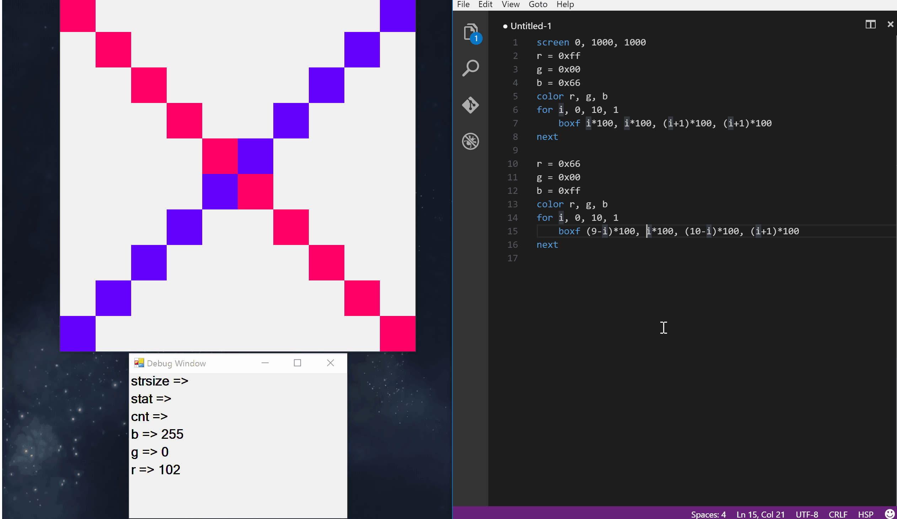

# hsp.rtm
[](https://github.com/kkrnt/hsp.rtm/releases/download/v0.4.1/hsp.rtm_v0.4.1.zip) [](https://github.com/kkrnt/hsp.rtm/blob/master/LICENSE)  

HSPをリアルタイムデバッグするためのプログラムです  
Visual Studio Codeの拡張機能として動作します



## Install
- ```install.exe```を実行し, 案内に従ってインストールを行って下さい
- アンインストールする場合は```install.exe```に対して```remove```をコマンドライン引数として渡して実行して下さい

## Usage
- ```Select Language Mode```から```HSP```を選択することでHSPのシンタックスハイライトが付きます
- ```Command Palet (Ctrl + Shift + P)```から```Start hsp.rtm```を選択することでHSPのリアルタイムデバッグが行えます

## Bugs
現在認識しているバグは以下です
- ループ中にDebug Windowが更新されない
 - gotoとwhileを用いた無限loopには対応しましたが, それ以外は未対応です
- 複数のウィンドウの表示
 - 複数のウィンドウを表示することに対応する予定は今のところありません
 
## Extension Grammar
- @using
 - C#におけるusingと同じようなことが出来ます
- @ref
 - C#におけるDLLの参照と同じようなことが出来ます
- @csharp ~ @end
 - @csharpという行から@endという行までC#のコードとして解釈します

## ETC
- Visual Studio Code上のシンタックスハイライトはpotato4dさんのtmLanguageファイルを利用させて頂きました
 - [https://github.com/potato4d/sublime-HSP](https://github.com/potato4d/sublime-HSP)
 - MITライセンスです([https://github.com/potato4d/sublime-HSP/blob/master/LICENSE](https://github.com/potato4d/sublime-HSP/blob/master/LICENSE))
- バグが非常に多いです  
 - システムに対してクリティカルなバグはないと思っていますが, まだ開発段階であるということを理解した上でご利用下さい
- 実装出来ている命令・コマンドは限りがあります

何かありましたら[@kkrnt](https://twitter.com/kkrnt)まで連絡頂けると幸いです

## LICENSE
[The MIT License](https://github.com/kkrnt/hsp.rtm/blob/master/LICENSE)

## 実装済みのもの
### Basic Grammar
- if
- else
- while
- wend
- for
- next
- _break
- _continue
- repeat
- loop
- switch
- swend
- swbreak
- case
- default
- goto
- gosub
- return

### Function
- int
- double
- str
- abs
- absf
- sin
- cos
- tan
- atan
- deg2rad
- rad2deg
- expf
- logf
- powf
- sqrt
- instr
- strlen
- strmid
- strtrim
- limit
- limitf
- length
- length2
- length3
- length4
- gettime
- rnd

### Command
- print
- mes
- exist
- delete
- bcopy
- mkdir
- chdir
- split
- strrep
- dim
- ddim
- end
- stop
- wait
- mci
- pos
- screen
- bgscr
- title
- redraw
- mouse
- font
- circle
- boxf
- line
- cls
- color
- picload
- getkey
- stick
- objsize
- dialog

### Macro
- m_pi
- and
- not
- or
- xor
- mousex
- mousey
- dir_cmdline
- dir_cur
- dir_desktop
- dir_exe
- dir_mydoc
- dir_sys
- dir_win
- ginfo_mx
- ginfo_my
- ginfo_sizex
- ginfo_sizey
- ginfo_r
- ginfo_g
- ginfo_b
- ginfo_cx
- ginfo_cy
- ginfo_dispx
- ginfo_dispy
- ginfo_wx1
- ginfo_wx2
- ginfo_wy1
- ginfo_wy2
- ginfo_sel
- hwnd
- __date__
- __time__
- msgothic
- msmincho
- font_normal
- font_bold
- font_italic
- font_underline
- font_strikeout
- screen_normal
- screen_hide
- screen_fixedsize
- screen_tool
- screen_frame